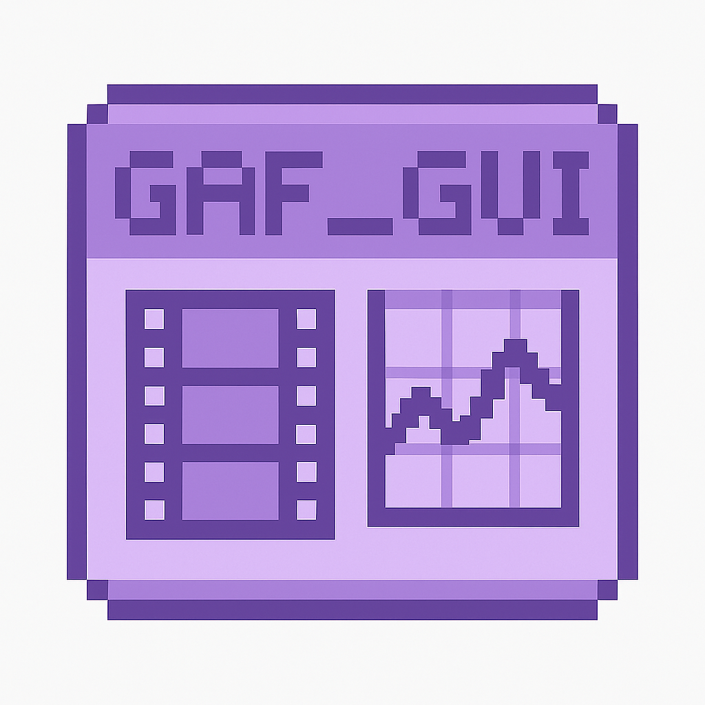

# GAF Film Calibration GUI

**Current Version**: 1.3.0 November 2025

---

---

---

## 🧾 Overview

This **Streamlit-based GUI** provides a pipeline for **GAFchromic film dosimetry calibration and measurement** using automatic segmentation, Optical Density estimation and polynomial curve fitting.
This tool is intended for **clinical medical physicists**, **dosimetrists**, **technicians** and **researchers** involved in radiotherapy QA or film dosimetry. 
The algorithms used for segmentation and polynomial fitting routines are fully transparent.
The films must be first scanned and named as explained below in the Usage section.

---

## 🧪 Features

- 📈 **Calibration Workflow**:
  - Automatic segmentation of irradiated and unirradiated film scans.
  - Polynomial fit of OD-to-dose relationship with uncertainty propagation.
  - Interactive visualization and calibration comparison.
  - Multiple calibration run saving and overlay plotting.

- 📊 **Measurement Workflow**:
  - Uses saved or uploaded calibrations for dose estimation.
  - Provides OD values and associated errors.
  - Supports results export to CSV and Excel.

- 💾 **Export Options**:
  - Fitted polynomial coefficients `.dat`.
  - Calibration plots as `.png`.
  - Dose tables as `.csv`, `.xlsx`.

---

## 🙏 Acknowledgements

**Author**: Alessandro Michele Ferrara  
**Contact**: alessandromichele.ferrara@gmail.com  
**Contributions and feedback** are welcome.
